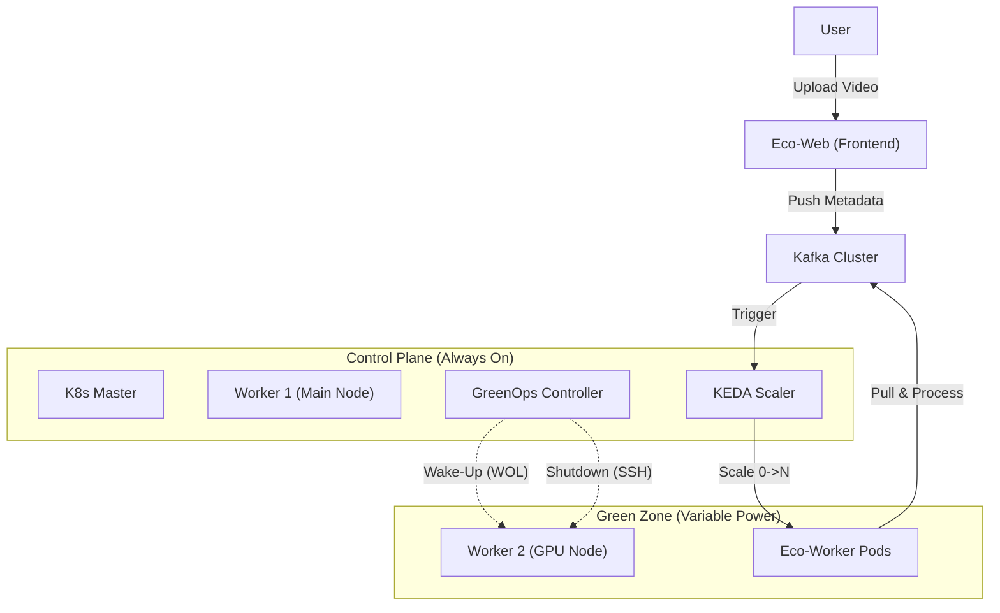

# Project Eco-Kube: Bare-Metal GreenOps Platform

> **"Zero-Carbon Idle Compute"**  
> 트래픽이 없으면 물리 서버의 전원을 자동으로 차단하고, 요청이 들어오면 수 초내로 부팅하여 응답하는 친환경 온프레미스 인프라.

---

## 1. 프로젝트 개요 (Executive Summary)

**Eco-Kube**는 퍼블릭 클라우드의 'Serverless' 개념을 온프레미스 베어메탈 환경에 구현한 프로젝트입니다.  
Kafka의 버퍼링 능력과 KEDA의 이벤트 기반 스케일링을 결합하여, **유휴 상태(Idle)의 Worker Node 전력을 0W로 만드는 것**이 핵심 목표입니다.

### 핵심 차별점
- **Cost Efficiency**: 사용하지 않는 고성능 GPU/CPU 서버의 전기를 물리적으로 차단.
- **Underlay Control**: 단순 파드 스케일링을 넘어, Kubernetes가 물리 노드의 ACPI(전원)를 직접 제어.
- **Event-Driven**: CPU 부하가 아닌 '실제 처리할 작업(Kafka Lag)' 기반의 정밀한 스케일링.

---

## Repository Structure (프로젝트 구조)

```bash
Eco-Stream-GreenOps/
├── manifests/                # Kubernetes Manifests
│   ├── kafka/                # Kafka Cluster, Topics, Strimzi Operator
│   ├── keda/                 # KEDA ScaledObjects, Scalers
│   ├── metallb/              # LoadBalancer Config
│   ├── ops/                  # Operational tools (Descheduler)
│   └── workloads/            # Application Deployments (Web, Worker)
├── scripts/                  # Automation Scripts
│   ├── greenops-controller.sh # Main Logic (Power Manager)
│   ├── wake_node.sh          # WOL Simulation
│   └── sleep_node.sh         # Shutdown Simulation
├── docs/                     # Documentation & Evidence
│   ├── PORTFOLIO.md          # Technical Summary
│   ├── logs_evidence.md      # Test Result Logs
│   └── DEMO_SCRIPT.md        # Demo Scenario
└── README.md                 # Project Overview
```

---

## 2. 아키텍처 (Architecture)



---

## 3. 기술 스택 (Tech Stack)

| Category | Technology | Usage |
| :--- | :--- | :--- |
| **Orchestration** | **Kubernetes v1.29** | 컨테이너 오케스트레이션 |
| **Event Bus** | **Kafka (KRaft)** | 대용량 트래픽 버퍼링 및 비동기 처리 |
| **Auto Scaling** | **KEDA** | Kafka Lag 기반의 Pod 오토스케일링 |
| **Scheduling** | **Descheduler** | 빈 노드 생성(Consolidation)을 위한 파드 재배치 |
| **GreenOps** | **Custom Bash/Python** | 물리 노드 전원 제어 (WOL / SSH Shutdown) |
| **Application** | **Flask + FFmpeg** | 비디오 업로드 및 트랜스코딩 워크로드 |

---

## 4. 시나리오 검증 (Verification)

### 시나리오: "Eco-Stream" (영상 변환 파이프라인)
1.  **Idle**: 트래픽 없음 → `Worker 2` **OFF (Power: 0W)**.
2.  **Traffic Spike**: 사용자 영상 50개 업로드 → Kafka Lag 급증.
3.  **Scale Out**: KEDA가 Worker Pod 10개 요청 → 노드 부족으로 `Pending`.
4.  **Wake Up**: Control Plane이 Pending 감지 → `Worker 2` **부팅 (WOL)**.
5.  **Processing**: `Worker 2` 합류 후 고속 변환 수행.
6.  **Scale In & Shutdown**: 작업 완료 → Pod 0개 → `Worker 2` **자동 종료**.

---

## 5. 시작하기 (Quick Start)

### 설치 및 배포
```bash
# 1. 인프라 배포 (Kafka, KEDA, Descheduler)
kubectl apply -f kafka-kraft.yaml
kubectl apply -f https://github.com/kedacore/keda/releases/download/v2.12.0/keda-2.12.0.yaml
kubectl apply -f descheduler.yaml

# 2. 애플리케이션 배포
kubectl apply -f deploy/

# 3. GreenOps 컨트롤러 실행
nohup ./greenops-controller.sh &
```

### 테스트 실행
```bash
# 스트레스 테스트 스크립트 실행 (영상 50개 업로드)
./stress_test.sh

# 모니터링
watch -n 1 "kubectl get pods; cat /var/log/greenops.log | tail -n 5"
```
